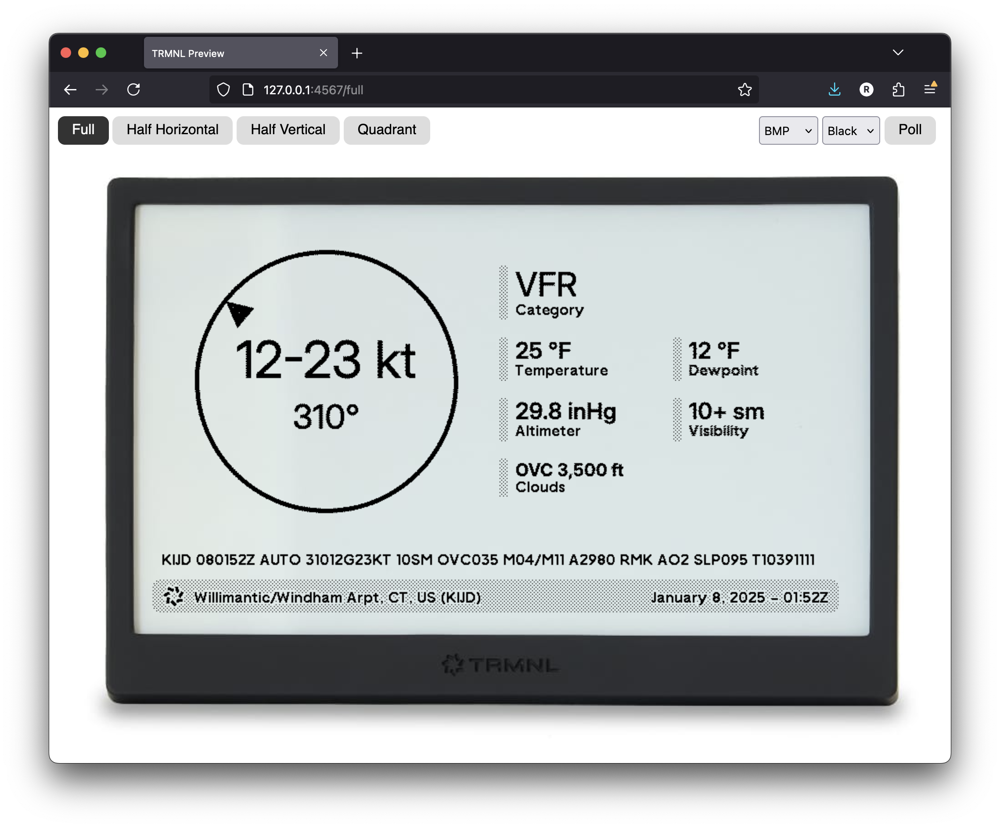

# trmnlp

A basic self-hosted web server to ease the development and sharing of [TRMNL](https://usetrmnl.com/) plugins.

[Liquid](https://shopify.github.io/liquid/) templates are rendered leveraging the [TRMNL Design System](https://usetrmnl.com/framework). They may be generated as HTML (faster, and a good approximation of the final result) or as BMP images (slower, but more accurate).

The server watches the filesystem for changes to the Liquid templates, seamlessly updating the preview without the need to refresh.



## Project Structure

This is the structure of a plugin project:

```
.
├── .trmnlp.yml
├── bin
│   └── dev
└── src
    ├── full.liquid
    ├── half_horizontal.liquid
    ├── half_vertical.liquid
    ├── quadrant.liquid
    └── settings.yml
```

## Creating a New Plugin

You can start building a plugin locally, then `push` it to the TRMNL server for display on your device.

```sh
trmnlp init my_plugin  # generate
cd my_plugin
trmnlp serve           # develop locally
trmnlp login           # authenticate
trmnlp push            # upload
```

## Modifying an Existing Plugin

If you have built a plugin with the web-based editor, you can `clone` it, work on it locally, and `push` changes back to the server.

```sh
trmnlp login                 # authenticate
trmnlp clone my_plugin [id]  # first download
cd my_plugin
trmnlp serve                 # develop locally
trmnlp push                  # upload
```

## Running trmnlp

### Via RubyGems

Prerequisites:

- Ruby 3.x
- For BMP rendering (optional):
  - Firefox
  - ImageMagick

```sh
gem install trmnl_preview
trmnlp serve
```

### Via Docker (`trmnlp serve` only)

```sh
docker run \
    -p 4567:4567 \
    -v /path/to/plugin/on/host:/plugin \
    trmnl/trmnlp
```

## `.trmnlp.yml` Reference - Project Config

The `.trmnlp.yml` file lives in the root of the plugin project, and is for configuring the local dev server.

System environment variables are made available in the `{{ env }}` Liquid varible in this file only. This can be used to safely
supply plugin secrets, like API keys.

All fields are optional.

```yaml
---
# auto-reload when files change (`watch: false` to disable)
watch:
  - src
  - .trmnlp.yml

# values of custom fields (defined in src/settings.yml)
custom_fields:
  station: "{{ env.ICAO }}" # interpolate $IACO environment variable

# override variables
variables:
  trmnl:
    user:
      name: Peter Quill
    plugin_settings:
      instance_name: Kevin Bacon Facts

```

## `src/settings.yml` Reference (Plugin Config)

The `settings.yml` file is part of the plugin definition. 

See [TRMNL documentation](https://help.usetrmnl.com/en/articles/10542599-importing-and-exporting-private-plugins#h_581fb988f0) for details on this file's contents.

## Contributing

Bug reports and pull requests are welcome on GitHub at https://github.com/usetrmnl/trmnlp.

## License

The gem is available as open source under the terms of the [MIT License](https://opensource.org/licenses/MIT).
